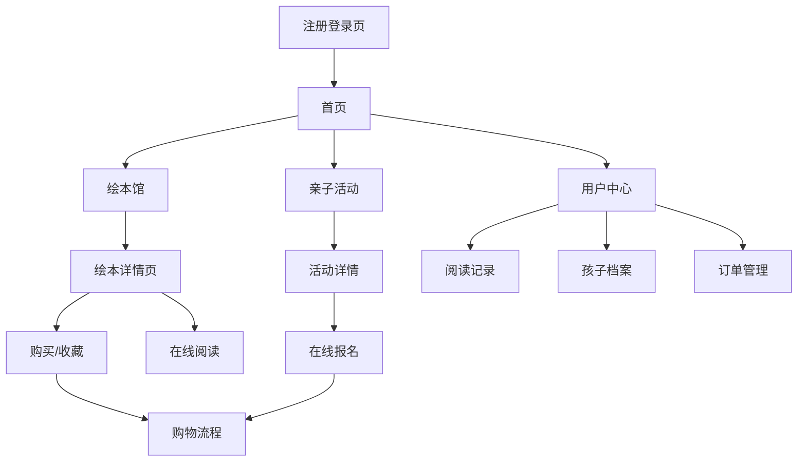

## 1. 产品概述
绘本岛是一个面向中国亲子家庭的绘本阅读与亲子活动平台，致力于为孩子们提供优质的绘本内容和丰富的亲子互动体验。平台通过数字化绘本阅读、亲子活动策划等功能，帮助家长更好地陪伴孩子成长，培养孩子的阅读兴趣和亲子关系。

目标市场：中国0-12岁儿童的亲子家庭，特别关注一二线城市的中产家庭用户。

## 2. 核心功能

### 2.1 用户角色
| 角色 | 注册方式 | 核心权限 |
|------|----------|----------|
| 家长用户 | 手机号/微信注册 | 浏览绘本、购买内容、报名活动、管理孩子档案 |
| 平台管理员 | 后台创建 | 内容管理、用户管理、订单管理、活动管理 |

### 2.2 功能模块
绘本岛平台包含以下主要页面：
1. **首页**：轮播图推荐、热门绘本展示、搜索功能、导航入口
2. **注册登录页**：手机号注册、微信快捷登录、孩子信息管理
3. **绘本馆页面**：分类浏览、筛选搜索、绘本列表展示
4. **绘本详情页**：封面展示、内容简介、用户评论、收藏购买
5. **亲子活动页**：活动列表、活动详情、在线报名
6. **阅读记录页**：阅读历史、打卡记录、阅读统计
7. **用户中心**：个人资料、孩子档案、订单管理、设置
8. **购物流程页**：购物车、支付确认、订单跟踪

### 2.3 页面详情
| 页面名称 | 模块名称 | 功能描述 |
|----------|----------|----------|
| 首页 | 轮播图模块 | 展示推荐绘本和活动，支持自动轮播和手动切换 |
| 首页 | 搜索栏模块 | 支持关键词搜索绘本和活动，提供搜索建议 |
| 首页 | 热门绘本 | 展示热门和推荐绘本，支持点击查看详情 |
| 首页 | 导航栏 | 提供主要功能入口，包括绘本馆、活动、个人中心等 |
| 注册登录页 | 手机号登录 | 支持手机号+验证码注册和登录 |
| 注册登录页 | 微信登录 | 支持微信一键授权登录 |
| 注册登录页 | 孩子信息 | 填写孩子姓名、年龄、性别等基本信息 |
| 绘本馆页面 | 分类导航 | 按年龄、主题、出版社等维度分类展示 |
| 绘本馆页面 | 筛选功能 | 支持多条件筛选和排序功能 |
| 绘本馆页面 | 绘本列表 | 卡片式展示绘本封面、标题、适合年龄 |
| 绘本详情页 | 封面展示 | 高清绘本封面，支持放大查看 |
| 绘本详情页 | 内容简介 | 展示绘本简介、作者信息、适合年龄 |
| 绘本详情页 | 用户评论 | 显示用户评价和打分，支持发表评价 |
| 绘本详情页 | 收藏购买 | 支持收藏和立即购买功能 |
| 亲子活动页 | 活动列表 | 展示所有活动，支持状态筛选 |
| 亲子活动页 | 活动详情 | 显示活动时间、地点、费用、报名情况 |
| 亲子活动页 | 在线报名 | 填写报名信息，支持在线支付 |
| 阅读记录页 | 阅读历史 | 显示已读绘本列表和阅读时间 |
| 阅读记录页 | 打卡功能 | 每日阅读打卡，连续打卡奖励 |
| 阅读记录页 | 阅读统计 | 展示阅读时长、绘本数量等数据 |
| 用户中心 | 个人资料 | 显示和编辑用户基本信息 |
| 用户中心 | 孩子档案 | 管理多个孩子的信息和阅读偏好 |
| 用户中心 | 订单管理 | 查看订单状态、物流信息 |
| 购物流程页 | 购物车 | 管理待购买商品，支持批量操作 |
| 购物流程页 | 支付确认 | 选择支付方式，确认订单信息 |
| 购物流程页 | 订单跟踪 | 查看订单状态和物流进度 |

## 3. 核心流程

### 用户注册登录流程
用户首次访问平台时，可选择手机号注册或微信快捷登录。注册完成后需要完善孩子基本信息，系统将根据孩子年龄推荐合适的绘本和活动。

### 绘本阅读流程
用户浏览绘本馆 → 选择感兴趣绘本 → 查看详情 → 购买/收藏 → 在线阅读 → 记录阅读进度 → 发表评论

### 活动报名流程
浏览活动列表 → 查看活动详情 → 点击报名 → 填写报名信息 → 在线支付 → 报名成功 → 活动提醒

### 购物流程
添加商品到购物车 → 查看购物车 → 确认订单 → 选择支付方式 → 完成支付 → 订单跟踪

## 4. 用户界面设计

### 4.1 设计风格
- **主色调**：米白色(#FAF8F5)作为背景，淡黄色(#FFF8DC)作为点缀，天蓝色(#87CEEB)作为强调色
- **按钮样式**：圆角矩形，柔和阴影，悬停效果
- **字体选择**：中文使用思源黑体，数字和英文使用Roboto，正文字号14-16px
- **布局风格**：卡片式布局，留白充足，层次分明
- **图标风格**：圆润线条，亲子友好，色彩温和

### 4.2 页面设计概述
| 页面名称 | 模块名称 | UI元素 |
|----------|----------|--------|
| 首页 | 轮播图 | 全宽轮播，圆角图片，底部指示器，自动播放间隔3秒 |
| 首页 | 搜索栏 | 圆角搜索框，搜索图标，占位文字"搜索绘本或活动" |
| 首页 | 热门绘本 | 横向滑动卡片，封面+标题，3列网格布局 |
| 绘本馆页面 | 分类导航 | 顶部标签页，选中状态高亮，支持横向滑动 |
| 绘本馆页面 | 绘本列表 | 卡片网格布局，封面占2/3，底部显示标题和年龄 |
| 绘本详情页 | 封面展示 | 大图封面，支持放大手势，右下角显示适合年龄 |
| 绘本详情页 | 购买按钮 | 底部固定按钮，绿色主色调，显示价格 |
| 亲子活动页 | 活动卡片 | 左图右文布局，显示时间地点，状态标签 |
| 用户中心 | 个人信息 | 顶部用户信息卡片，头像、昵称、孩子信息 |
| 阅读记录页 | 阅读卡片 | 时间轴布局，显示阅读时长和完成度 |

### 4.3 响应式设计
- **移动端优先**：核心设计以iPhone 12 (390px) 为基准
- **平板适配**：768px以上显示更多列，优化图片尺寸
- **桌面端**：1200px以上最大宽度限制，居中显示
- **触摸优化**：按钮最小44px，支持滑动手势
- **加载优化**：图片懒加载，骨架屏占位