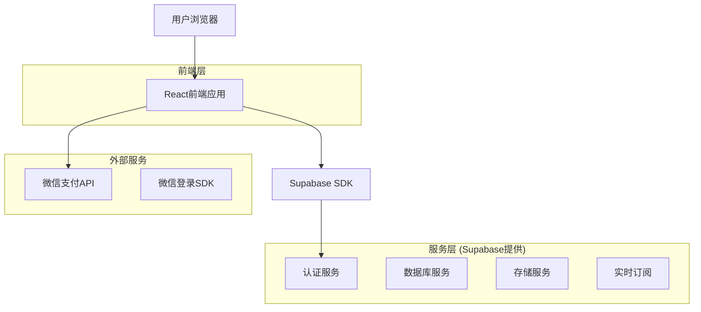
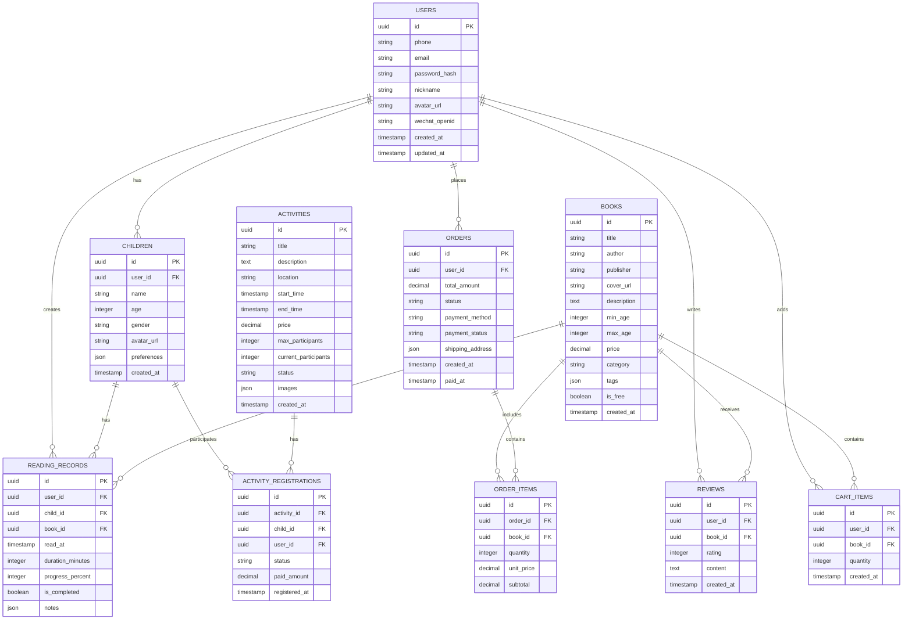

## 1. 架构设计



## 2. 技术描述

* **前端**: React\@18 + TypeScript\@5 + Vite\@5 + Tailwind CSS\@3

* **后端**: Supabase (BaaS平台，提供认证、数据库、存储服务)

* **支付**: 微信支付API集成

* **部署**: Vercel (前端) + Supabase (后端服务)

## 3. 路由定义

| 路由                | 用途                  |
| ----------------- | ------------------- |
| /                 | 首页，展示轮播图、热门绘本和导航    |
| /login            | 登录页面，支持手机号和微信登录     |
| /register         | 注册页面，完善用户信息和孩子档案    |
| /books            | 绘本馆页面，分类浏览所有绘本      |
| /books/:id        | 绘本详情页，展示具体绘本信息和购买选项 |
| /activities       | 亲子活动页面，展示所有活动列表     |
| /activities/:id   | 活动详情页，展示活动详情和报名功能   |
| /reading-record   | 阅读记录页面，展示用户阅读历史     |
| /profile          | 用户中心，管理个人信息和设置      |
| /profile/children | 孩子档案管理页面            |
| /profile/orders   | 订单管理页面，查看历史订单       |
| /cart             | 购物车页面，管理待购买商品       |
| /checkout         | 结算页面，确认订单和支付        |
| /order-success    | 订单成功页面，展示支付结果       |

## 4. 数据模型

### 4.1 数据模型定义



### 4.2 数据定义语言

用户表 (users)

```sql
-- 创建用户表
CREATE TABLE users (
    id UUID PRIMARY KEY DEFAULT gen_random_uuid(),
    phone VARCHAR(20) UNIQUE,
    email VARCHAR(255) UNIQUE,
    password_hash VARCHAR(255),
    nickname VARCHAR(100) NOT NULL,
    avatar_url TEXT,
    wechat_openid VARCHAR(100) UNIQUE,
    created_at TIMESTAMP WITH TIME ZONE DEFAULT NOW(),
    updated_at TIMESTAMP WITH TIME ZONE DEFAULT NOW()
);

-- 创建索引
CREATE INDEX idx_users_phone ON users(phone);
CREATE INDEX idx_users_email ON users(email);
CREATE INDEX idx_users_wechat ON users(wechat_openid);

-- 授权访问
GRANT SELECT ON users TO anon;
GRANT ALL PRIVILEGES ON users TO authenticated;
```

孩子档案表 (children)

```sql
-- 创建孩子档案表
CREATE TABLE children (
    id UUID PRIMARY KEY DEFAULT gen_random_uuid(),
    user_id UUID REFERENCES users(id) ON DELETE CASCADE,
    name VARCHAR(100) NOT NULL,
    age INTEGER CHECK (age >= 0 AND age <= 18),
    gender VARCHAR(10) CHECK (gender IN ('male', 'female')),
    avatar_url TEXT,
    preferences JSONB DEFAULT '{}',
    created_at TIMESTAMP WITH TIME ZONE DEFAULT NOW()
);

-- 创建索引
CREATE INDEX idx_children_user_id ON children(user_id);

-- 授权访问
GRANT SELECT ON children TO anon;
GRANT ALL PRIVILEGES ON children TO authenticated;
```

绘本表 (books)

```sql
-- 创建绘本表
CREATE TABLE books (
    id UUID PRIMARY KEY DEFAULT gen_random_uuid(),
    title VARCHAR(255) NOT NULL,
    author VARCHAR(255),
    publisher VARCHAR(255),
    cover_url TEXT NOT NULL,
    description TEXT,
    min_age INTEGER DEFAULT 0,
    max_age INTEGER DEFAULT 12,
    price DECIMAL(10,2) DEFAULT 0.00,
    category VARCHAR(100),
    tags JSONB DEFAULT '[]',
    is_free BOOLEAN DEFAULT false,
    created_at TIMESTAMP WITH TIME ZONE DEFAULT NOW()
);

-- 创建索引
CREATE INDEX idx_books_category ON books(category);
CREATE INDEX idx_books_age ON books(min_age, max_age);
CREATE INDEX idx_books_price ON books(price);

-- 授权访问
GRANT SELECT ON books TO anon;
GRANT ALL PRIVILEGES ON books TO authenticated;
```

阅读记录表 (reading\_records)

```sql
-- 创建阅读记录表
CREATE TABLE reading_records (
    id UUID PRIMARY KEY DEFAULT gen_random_uuid(),
    user_id UUID REFERENCES users(id) ON DELETE CASCADE,
    child_id UUID REFERENCES children(id) ON DELETE CASCADE,
    book_id UUID REFERENCES books(id) ON DELETE CASCADE,
    read_at TIMESTAMP WITH TIME ZONE DEFAULT NOW(),
    duration_minutes INTEGER DEFAULT 0,
    progress_percent INTEGER DEFAULT 0 CHECK (progress_percent >= 0 AND progress_percent <= 100),
    is_completed BOOLEAN DEFAULT false,
    notes JSONB DEFAULT '{}',
    UNIQUE(user_id, child_id, book_id)
);

-- 创建索引
CREATE INDEX idx_reading_records_user_id ON reading_records(user_id);
CREATE INDEX idx_reading_records_child_id ON reading_records(child_id);
CREATE INDEX idx_reading_records_book_id ON reading_records(book_id);
CREATE INDEX idx_reading_records_read_at ON reading_records(read_at DESC);

-- 授权访问
GRANT SELECT ON reading_records TO anon;
GRANT ALL PRIVILEGES ON reading_records TO authenticated;
```

订单表 (orders)

```sql
-- 创建订单表
CREATE TABLE orders (
    id UUID PRIMARY KEY DEFAULT gen_random_uuid(),
    user_id UUID REFERENCES users(id) ON DELETE CASCADE,
    order_number VARCHAR(50) UNIQUE DEFAULT TO_CHAR(NOW(), 'YYYYMMDDHH24MISS') || LPAD(FLOOR(RANDOM() * 1000)::TEXT, 3, '0'),
    total_amount DECIMAL(10,2) NOT NULL,
    status VARCHAR(50) DEFAULT 'pending' CHECK (status IN ('pending', 'paid', 'shipped', 'completed', 'cancelled')),
    payment_method VARCHAR(50),
    payment_status VARCHAR(50) DEFAULT 'unpaid',
    shipping_address JSONB DEFAULT '{}',
    created_at TIMESTAMP WITH TIME ZONE DEFAULT NOW(),
    paid_at TIMESTAMP WITH TIME ZONE
);

-- 创建索引
CREATE INDEX idx_orders_user_id ON orders(user_id);
CREATE INDEX idx_orders_status ON orders(status);
CREATE INDEX idx_orders_created_at ON orders(created_at DESC);

-- 授权访问
GRANT SELECT ON orders TO anon;
GRANT ALL PRIVILEGES ON orders TO authenticated;
```

## 5. 核心API接口

### 5.1 认证相关API

用户注册

```
POST /api/auth/register
```

请求参数：

| 参数名                | 参数类型   | 是否必需 | 描述    |
| ------------------ | ------ | ---- | ----- |
| phone              | string | true | 手机号   |
| password           | string | true | 密码    |
| nickname           | string | true | 用户昵称  |
| verification\_code | string | true | 短信验证码 |

响应：

```json
{
  "success": true,
  "data": {
    "user": {
      "id": "uuid",
      "nickname": "用户昵称",
      "phone": "13800138000"
    },
    "token": "jwt_token_string"
  }
}
```

### 5.2 绘本相关API

获取绘本列表

```
GET /api/books
```

查询参数：

| 参数名      | 参数类型    | 是否必需  | 描述        |
| -------- | ------- | ----- | --------- |
| category | string  | false | 分类筛选      |
| age\_min | integer | false | 最小年龄      |
| age\_max | integer | false | 最大年龄      |
| page     | integer | false | 页码，默认1    |
| limit    | integer | false | 每页数量，默认20 |

响应：

```json
{
  "success": true,
  "data": {
    "books": [
      {
        "id": "uuid",
        "title": "绘本标题",
        "cover_url": "https://example.com/cover.jpg",
        "author": "作者名",
        "min_age": 3,
        "max_age": 6,
        "price": 29.90,
        "is_free": false
      }
    ],
    "total": 100,
    "page": 1,
    "limit": 20
  }
}
```

### 5.3 阅读记录API

记录阅读进度

```
POST /api/reading-records
```

请求参数：

| 参数名               | 参数类型    | 是否必需  | 描述          |
| ----------------- | ------- | ----- | ----------- |
| child\_id         | string  | true  | 孩子ID        |
| book\_id          | string  | true  | 绘本ID        |
| duration\_minutes | integer | false | 阅读时长(分钟)    |
| progress\_percent | integer | false | 阅读进度(0-100) |
| is\_completed     | boolean | false | 是否完成        |

### 5.4 订单相关API

创建订单

```
POST /api/orders
```

请求参数：

| 参数名               | 参数类型   | 是否必需 | 描述     |
| ----------------- | ------ | ---- | ------ |
| items             | array  | true | 订单商品列表 |
| shipping\_address | object | true | 收货地址信息 |

items数组元素：

| 参数名      | 参数类型    | 是否必需 | 描述   |
| -------- | ------- | ---- | ---- |
| book\_id | string  | true | 绘本ID |
| quantity | integer | true | 购买数量 |

## 6. 前端组件结构

### 6.1 核心组件

```
src/
├── components/           # 通用组件
│   ├── common/          # 基础组件
│   │   ├── Button.tsx   # 按钮组件
│   │   ├── Input.tsx    # 输入框组件
│   │   ├── Card.tsx     # 卡片组件
│   │   └── Modal.tsx    # 模态框组件
│   ├── layout/          # 布局组件
│   │   ├── Header.tsx   # 头部导航
│   │   ├── Footer.tsx   # 底部导航
│   │   └── Layout.tsx   # 页面布局
│   └── business/        # 业务组件
│       ├── BookCard.tsx # 绘本卡片
│       ├── ActivityCard.tsx # 活动卡片
│       └── ReadingProgress.tsx # 阅读进度
├── pages/               # 页面组件
│   ├── Home.tsx        # 首页
│   ├── Login.tsx       # 登录页
│   ├── Books.tsx       # 绘本馆
│   ├── BookDetail.tsx  # 绘本详情
│   ├── Activities.tsx  # 亲子活动
│   └── Profile.tsx     # 用户中心
├── hooks/              # 自定义Hooks
│   ├── useAuth.ts      # 认证相关
│   ├── useBooks.ts     # 绘本数据
│   └── useOrders.ts    # 订单管理
├── services/           # API服务
│   ├── api.ts         # API基础配置
│   ├── auth.ts        # 认证API
│   ├── books.ts       # 绘本API
│   └── orders.ts      # 订单API
├── store/             # 状态管理
│   ├── authStore.ts   # 用户状态
│   ├── cartStore.ts   # 购物车状态
│   └── bookStore.ts   # 绘本数据状态
└── utils/             # 工具函数
    ├── request.ts     # 请求封装
    ├── storage.ts     # 本地存储
    └── validate.ts    # 表单验证
```

### 6.2 状态管理设计

使用Zustand进行状态管理，主要包含以下store：

* **authStore**: 用户认证状态、登录信息、权限管理

* **cartStore**: 购物车状态、添加删除商品、数量管理

* **bookStore**: 绘本数据缓存、分类筛选、搜索状态

* **activityStore**: 活动数据、报名状态、活动筛选

### 6.3 响应式设计

* 断点设置：

  * 移动端：320px - 767px

  * 平板端：768px - 1023px

  * 桌面端：1024px+

* 适配策略：

  * 移动端：单列布局，底部导航

  * 平板端：双列网格，侧边导航

  * 桌面端：最大宽度限制，居中显示

