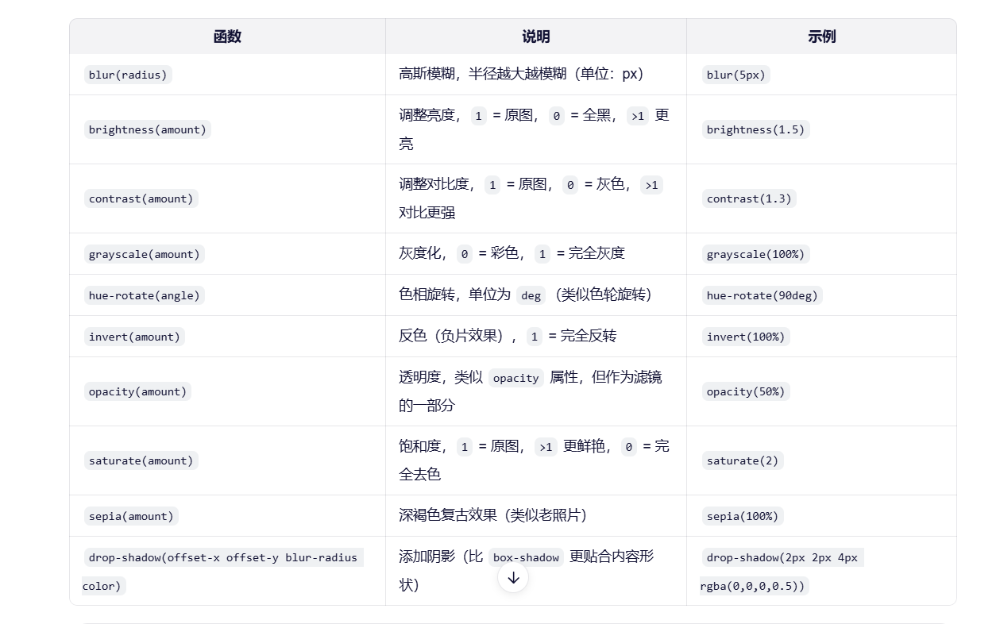

## css4 变量'

filter 是 CSS 中一个非常强大的属性，用于对元素（如图片、文本、容器等）应用图形视觉效果，比如模糊、变暗、调色、对比度调整等。它类似于图像编辑软件（如 Photoshop）中的滤镜功能。



```js
selector {
  filter: blur(半径);
}
```
blur() 是 filter（滤镜）属性的一个函数，用于给元素应用高斯模糊效果。
参数：模糊半径（如 5px），值越大，模糊越强。默认值为 0（无模糊）。

### 定义变量
CSS 使用 :root 伪类 来定义 CSS 自定义属性（CSS 变量）

```css
:root {
--spacing: 10px;
--blur: 10px;
--base: #ffc600;
}
```

`:root`
表示文档的根元素（在 HTML 中就是 <html> 元素）。它的优先级高于 html 选择器，是定义全局 CSS 变量的最佳位置。

`--spacing`, `--blur`, `--base`
这些是以 -- 开头的 自定义属性（CSS 变量）：
`--spacing`: 用于统一控制间距（如 margin、padding）
`--blur`: 用于统一模糊半径（比如配合 filter: blur(var(--blur))）
`--base`: 一个主色调（亮黄色 #ffc600），可用于按钮、边框、文字等

### 使用变量

在其他 CSS 规则中，通过 var() 函数引用：

```css
img {
    padding: var(--spacing);
    background: var(--base);
    filter: blur(var(--blur));
}
```

#### 如果变量未定义，var() 还支持提供默认值：
css
color: var(--text-color, black); / 如果 --text-color 不存在，则用 black /

#### 动态修改（通过 JavaScript）

你可以用 JavaScript 动态改变这些变量，从而实时更新整个页面的样式：

```javascript
// 修改 --blur 的值为 5px
document.documentElement.style.setProperty('--blur', '5px');

// 修改 --base 颜色
document.documentElement.style.setProperty('--base', '#ff6b6b');
```

```js
document.documentElement.style.setProperty(`--${this.name}`, this.value + suffix);
```

`document.documentElement`：指的是当前文档的根元素，在 HTML 文档中通常是 <html> 元素
`.style`：访问该元素的内联样式。
`.setProperty()`：是一个用于设置 CSS 属性的方法，接受两个参数：
第一个参数是要设置的属性名称，这里使用了模板字符串 `--${this.name}` 来动态生成 CSS 变量名。
第二个参数是该属性的新值，这里的值由 this.value 和 suffix 组合而成，例如 '14' + 'px' 可能会变成 '14px'